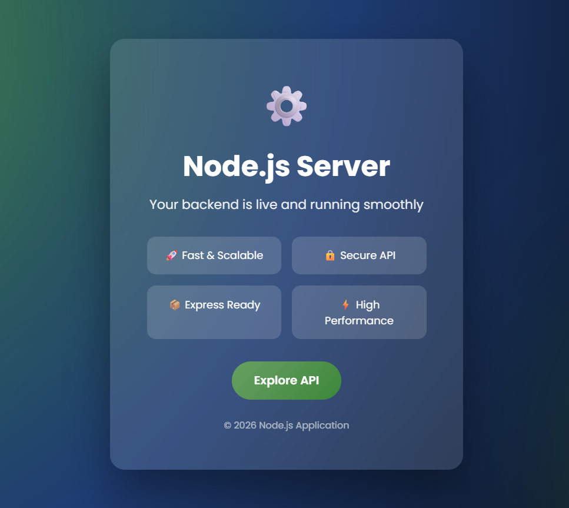

# Node.js Server - API Dashboard

Welcome to your **Node.js backend**!  
Your server is live and running smoothly, providing a **Fast, Scalable, and Secure API** ready for development.



---

## 🚀 Features

- **Fast & Scalable**: Optimized for high performance
- **Secure API**: Ready for production with security best practices
- **Express Ready**: Built with Express.js for easy routing
- **High Performance**: Minimal overhead and fast response times

---

## 🛠 Prerequisites

- [Node.js](https://nodejs.org/) v18+
- [npm](https://www.npmjs.com/)
- [PostgreSQL](https://www.postgresql.org/download/)
- PowerShell / Terminal (for Windows users)

---

## 📦 Installation

1. Clone the repository:
```bash
git clone https://github.com/mhmd-laravel-wd/Node_JS_Express.git
cd Node_JS_Express
